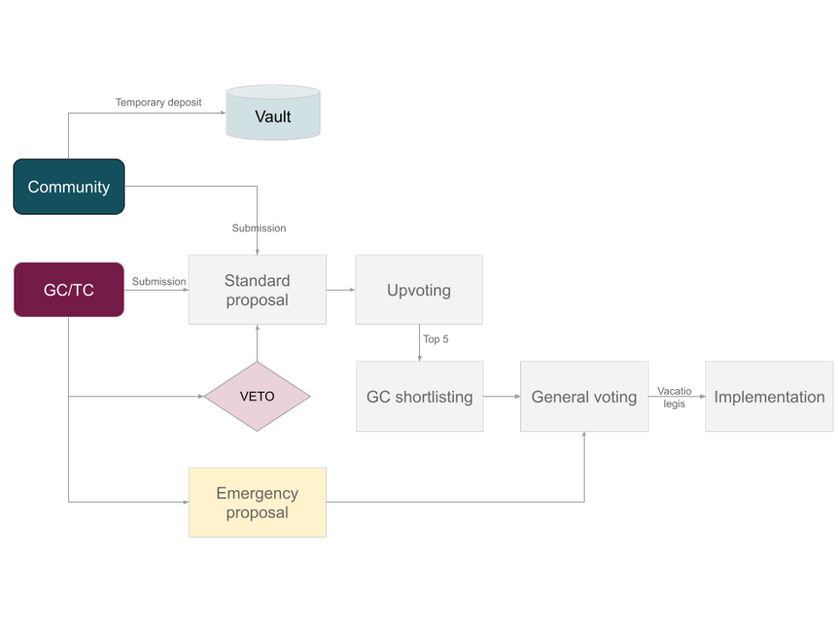

# TENKA Council

#### General Council (GC) 

The First General Council will be formed from the Ignite Tournaments founding team. Each year, the GC will initiate a global election for new members of the committee by either accepting or submitting proposals for candidates. Top upvoted proposals for candidates will be treated as nominations for new committee members. Timeline for upvoting candidates for new GC members is 30 days.

#### Technical Committee (TC) 

The First Technical Committee will be appointed by the Ignite Tournaments founding team. New members of the TC will be re-appointed by the General Council each year, 7 days after the new GC is elected.

#### Voting Power 

Committee votes are not subjected to any weighting. In other words, 1 GC or TC member has one vote. Community votes are subjected to weighting using a staking score and activity multipliers.

_Example:_

_John has a voting power of 450, Alex - 1000 and Tony - 1000. John and Alex do not have any activity multipliers, but, Tony has unlocked the x1.525 activity multiplier. John and Alex voted on rejecting the submitted proposal, but Tony voted in favor. Proposal is being accepted as the final voting count is **1525 in favor** (1000 x 1.525) **** versus **1450 not in favor** (1450 x 1)._

Please refer to the ‘_loyalty & activity appreciation’_ section of this document for more details.

Each proposal needs to indicate the amount of financial support required to execute the proposal. GC has prerogative to

* Ask proposal submitter to provide missing cost estimate or justify it
* Amend the cost estimate of proposal execution
* Reject (veto) the decision due to missing details or irrational cost estimate

#### Majorities 

| **Decision type**                                                        | **Majority required**                        | **Required Quorum** |
| ------------------------------------------------------------------------ | -------------------------------------------- | ------------------- |
| Veto - General Council                                                   | 3/5                                          | More than 50%       |
| Veto - Technical Committee                                               | 4/5                                          | 100%                |
| Submitting emergency proposals by General Council or Technical Committee | 3/5                                          | 50%                 |
| General Voting                                                           | Simple majority (more votes “Yes” than “No”) | N/A                 |

#### Timelines 

| **Process stage**                             | **Timeline**                                                     |
| --------------------------------------------- | ---------------------------------------------------------------- |
| Deposit lockup period - accepted proposal     | Vacatio legis + 14 days                                          |
| Deposit lockup period - rejected proposal     | Vacatio legis + 6 months                                         |
| Shortlisting period                           | Last 14 days, start immediately after voting season announcement |
| Voting season                                 | Last 7 days, starts 14 days after voting season announcement     |
| Vacatio legis                                 | 7 days                                                           |
| Emergency proposal - moving to general voting | 4 hours from proposal submission                                 |
| General voting on emergency proposal          | 24 hours                                                         |
| Emergency proposal - vacatio legis            | 48 hours                                                         |

### **Governance Process - Visual Summary**

