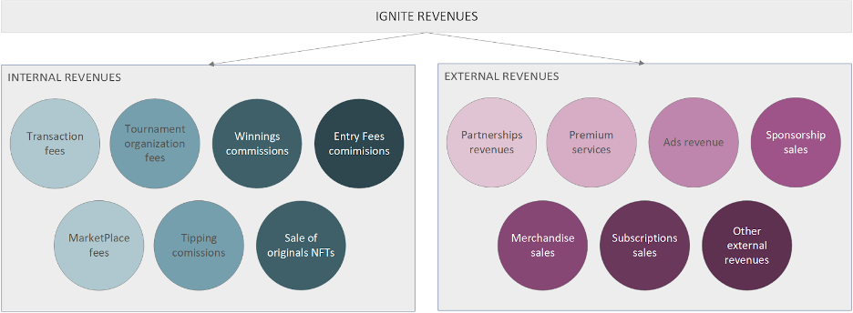

# Revenue Model

The Ignite Tournaments Treasury will be connected to multiple internal and external revenue streams, including:

* **Internal revenue streams:**
  * Platform transaction fees
  * Tournament organization fees
  * Winning commissions
  * Entry fees commissions
  * Marketplace commissions
  * Tipping commissions
  * Sale of originals NFTs
* **External revenue streams**
  * Strategic partnerships revenues
  * Premium positioning on Ignite Platform
  * Ad revenue
  * Sponsorship sales
  * Merchandise sales
  * Subscription fees
  * Other external revenues

