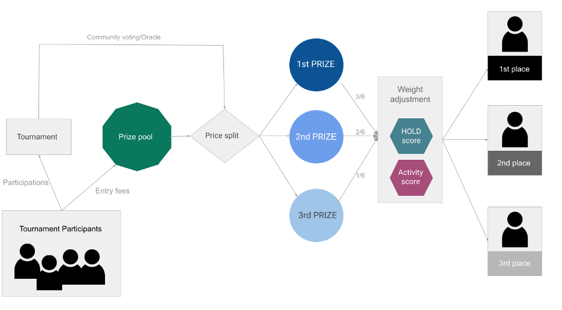

# Rewards Distribution

Ignite Tournaments rewards are distributed via two streams:&#x20;

* Tournament winnings&#x20;
* Continuous rewards distribution curve&#x20;

**Tournament winnings** are rewards for top places in each tournament organized via the Ignite Tournaments platform, with the prize splits and number winners determined by the tournament organizer. Sponsored prizes also are included in tournament winnings.

Winning prizes are created from entry fees paid by each tournament participant. These winnings are subjected to bonus multipliers connected with HODL and ACTIVITY levels, which affect the overall split of rewards.&#x20;

_Example: The tournament organizer decided that there will be 3 winning prizes, and their size will be determined by the following split of a prize pool: 1st place = prize pool \* 3/6, 2nd place=  prize pool \* 2/6, 3rd place = prize pool \* 1/6  Such split is referred to as  “primary split”  and is subjected to secondary adjustment based on each winner's HODL and Activity level._&#x20;

_Figure 6 - Weighted winnings distribution (example using 3 places with 50%, 33% and 16% prize split)_&#x20;

Applying weighted winnings splits might change the base proportions of the winnings per each place. In rare cases, the reward for a lower place might be higher than the reward for 2nd or 1st place. Please see the example below for reference:&#x20;

| Price pool (TENKA) | 100             |                 |                     |                |          |
| ------------------ | --------------- | --------------- | ------------------- | -------------- | -------- |
|                    |                 |                 |                     |                |          |
| Rank               | Standard weight | HODL multiplier | Activity multiplier | Final weight r | Winnings |
| 1                  | 3               | 1.05            | 1.125               | 3.525          | 41.96    |
| 2                  | 2               | 1.1             | 1.05                | 2.3            | 27.38    |
| 3                  | 1               | 2.05            | 1.525               | 2.575          | 30.65    |

**Continuous rewards distribution curve** is related to TENKA rewards for liquidity providers. These rewards are released based on a logarithmic curve, meaning that the quantitative amount of rewards drops gradually decreases over time - please refer to the chart below for better understanding.&#x20;

>)

TENKA rewards are also subjected to a weighted split, meaning that Ignite Tournaments users with higher scores will get higher rewards. Please refer to the workflow below for more details: &#x20;

**Earning Gaming Points**&#x20;

Gaming Points are a key asset used to calculate activity scores and increase account level. They can be earned by Ignite Tournaments platform users by:&#x20;

* Participating in tournaments&#x20;
* Winning tournaments
* Buying NFTs from the Ignite Tournaments NFT marketplace&#x20;
* Tipping other players/streamers

The exact amount of Gaming Points earned by the player is equal to the **USD volume** connected with the rewarded activity. Please refer to the table below:&#x20;

| **Rewarded activity**                                   | **Method of calculating Gaming Points**           |
| ------------------------------------------------------- | ------------------------------------------------- |
| Participating in tournaments                            | Gaming Points = USD value spent on entry fee      |
| Winning tournaments                                     | Gaming Points = USD value of reward won           |
| Buying NFTs from the Ignite Tournaments NFT marketplace | Gaming Points = USD value of bought/sold item     |
| Tipping other players/streamers                         | Gaming Points = USD value of received/given tips  |

Please note that although Gaming Points are accrued over time, the benefits related to their total sum owned by the player are closely correlated to:&#x20;

* **Activity score** calculation methodology - please refer to the _loyalty appreciation model_ section of this document for more details.&#x20;

Ignite Tournaments **seasons** (separate global competitions in which top Gaming Points holders are entitled to claim extra rewards) - please refer to _Gaming Points_ section of this document for more details.
